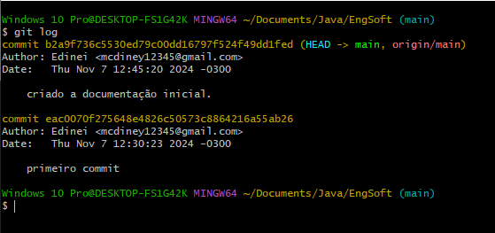
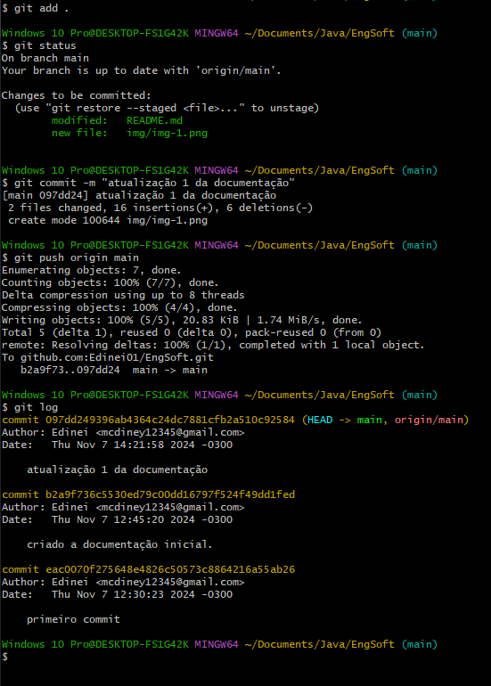
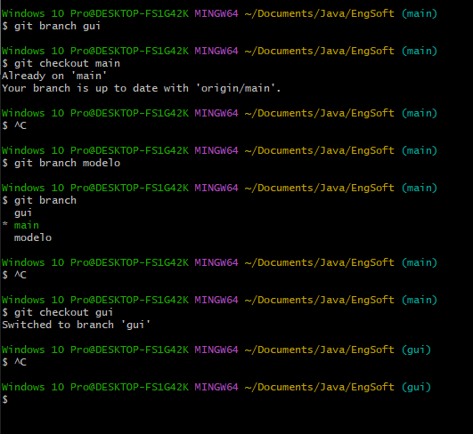
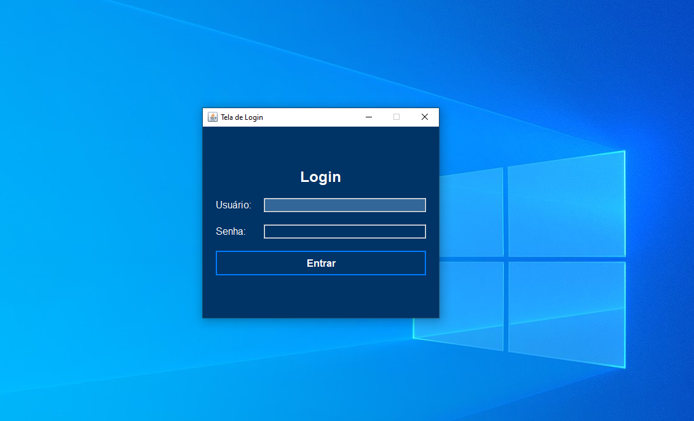
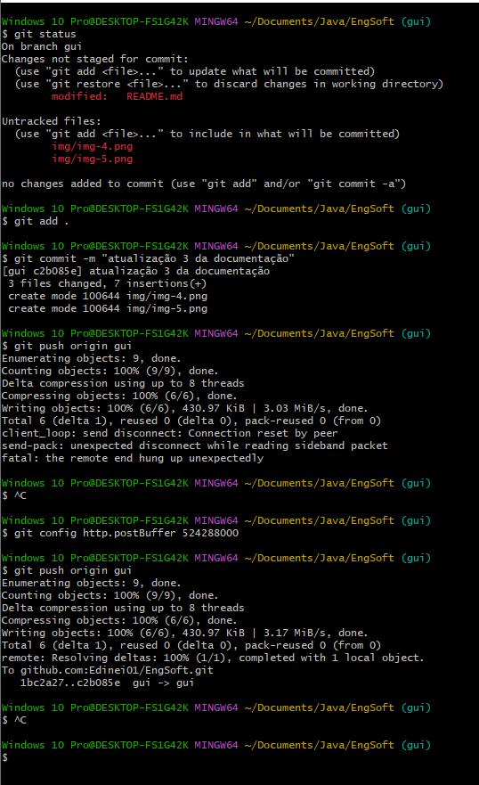
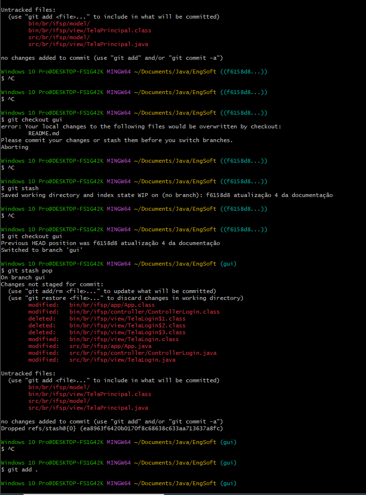
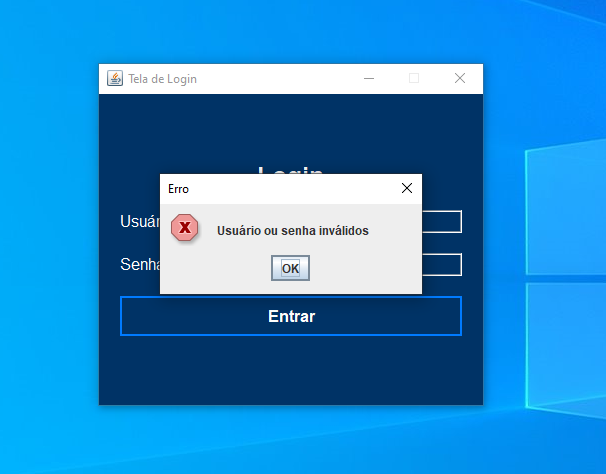
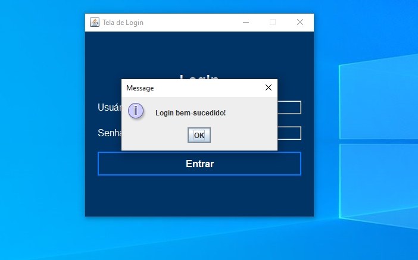
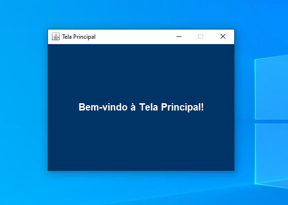

# Projeto: Janela de Login em Java Swing

Este projeto é uma atividade prática da disciplina **Engenharia de Software** sobre **Gerenciamento de Configuração e Controle de Versão (GCCV)**, demonstrando o uso de Git para gerenciamento e controle de versão.

## Gerenciamento de Configuração (GC)

Este projeto aplicou conceitos de Gerenciamento de Configuração (GC) com os seguintes elementos:

1. **Identificação e Controle de Configuração**: Foram configurados e catalogados os componentes essenciais, incluindo código-fonte, bibliotecas, arquivos de configuração e documentação.
2. **Controle de Mudanças**: Todas as alterações foram documentadas e registradas com mensagens de commit descritivas. Mudanças foram aprovadas conforme o fluxo de desenvolvimento.
3. **Relatório de Status de Configuração**: O histórico de commits foi utilizado para acompanhar as modificações e garantir a rastreabilidade das alterações ao longo do desenvolvimento.
4. **Auditoria e Verificação de Configuração**: Após o merge das branches, o projeto foi verificado para garantir que estava em conformidade com os requisitos e funcionando corretamente.

## Funcionalidades

Implementação de uma interface de login em Java, utilizando:
- **Java Swing** para a interface gráfica.
- **Classes de autenticação** para validar login e senha.

## Arquitetura do Projeto

Este projeto foi desenvolvido seguindo o modelo **MVC (Model-View-Controller)**, que separa as responsabilidades da aplicação nas seguintes camadas:
- **Model (Modelo)**: Contém a lógica de autenticação e manipulação de dados.
- **View (Visão)**: Responsável pela interface gráfica com o usuário, utilizando **Java Swing**.
- **Controller (Controle)**: Coordena a interação entre a interface gráfica (View) e a lógica de negócios (Model).

## Estrutura de Branches

1. **Main**: Branch principal do projeto.
2. **Design/GUI**: Para o desenvolvimento da interface gráfica.
3. **Classes**: Para a lógica de autenticação.

## Exercício Prático de Controle de Versão

Este projeto utilizou Git como ferramenta de controle de versão. Abaixo está o fluxo prático implementado:

### 1. Branches e Desenvolvimento Paralelo
- Foram criadas as branches `gui` e `modelo` para desenvolvimento paralelo.
- Cada branch possui commits que documentam as alterações realizadas e descrevem como cada modificação contribuiu para a organização do projeto.

### 2. Desenvolvimento e Commits
- As modificações foram documentadas com mensagens de commit descritivas.
- Cada commit explica o que foi alterado e por que essa alteração é relevante para o projeto, ajudando na rastreabilidade.

### 3. Merge e Resolução de Conflitos
- Um merge foi realizado entre as branches para integrar as funcionalidades, e foi encontrado um conflito.
- **Conflito**: O conflito surgiu na implementação das funcionalidades da interface gráfica e da autenticação.
- **Decisão de Resolução**: A resolução foi feita priorizando as alterações da branch `design/gui`.
- **Resultado Final**: Após a resolução do conflito, o projeto foi testado para garantir que todas as funcionalidades estavam integradas corretamente.

### 4. Resolução de Problema de Checkout e Uso do `git stash`
Durante o desenvolvimento, encontrei um problema ao tentar alternar entre branches no Git. O Git acusou que minhas alterações não estavam salvas, o que impedia a troca de branch. Para resolver isso, utilizei o comando `git stash` para salvar temporariamente as alterações não comitadas e permitir a troca de branch.

**Passos Realizados**:
1. **Problema no Checkout**: O Git pediu para salvar ou descartar as alterações não salvas.
2. **Uso do `git stash`**: Usei `git stash` para armazenar temporariamente as alterações.
3. **Troca de Branch**: Realizei a troca de branch com sucesso após o `stash`.
4. **Recuperação de Alterações**: Usei `git stash pop` para recuperar as alterações após a troca de branch.
5. **Commit das Alterações**: Com as alterações recuperadas, realizei o commit e continuei o desenvolvimento normalmente.

### 5. Histórico de Commits
- Abaixo está uma captura de tela do histórico de commits (`git log`), mostrando as alterações realizadas no projeto, cada commit contendo uma descrição clara sobre a modificação:

   

## Capturas de Tela do Git

### Commit: "atualização 1 da documentação"
Esta captura de tela mostra o commit com a mensagem `"atualização 1 da documentação"`:


### Criação e Verificação das Branches

Exemplo dos comandos usados para criar e alternar entre branches:



### Commit e Criação da Tela de Login
Aqui está o commit e as alterações realizadas para a criação da tela de login:


### Tela de Login em Execução
Aqui está a captura da tela de login funcionando no ambiente Java Swing:


### Nova Imagem Adicionada: img-6.png
Aqui está a nova captura de tela adicionada:


### Nova Imagem Adicionada: img-7.png
Aqui está a nova captura de tela adicionada para ilustrar a interface gráfica com as correções e melhorias:


### Tela de Login com Login ou Senha Inválidos: img-8.png
Aqui está a captura de tela mostrando a tela de login com a mensagem de erro quando o usuário digita um login ou senha inválidos:


### Tela de Login com Sucesso: img-9.png
Aqui está a captura de tela mostrando a tela de login com a mensagem de "Logado com Sucesso" após a autenticação correta:


### Tela Principal: img-10.png
Aqui está a captura de tela mostrando a tela principal do sistema após o login bem-sucedido:


## Resumo do que foi Realizado

Este projeto prático demonstrou o uso do Git para Gerenciamento de Configuração e Controle de Versão (GCCV) em um ambiente de desenvolvimento de software. Foram criadas branches para o desenvolvimento paralelo de funcionalidades, seguidas de um merge com resolução de conflitos. Cada alteração foi documentada em commits descritivos, garantindo rastreabilidade e organização.

O exercício reforçou conceitos fundamentais do GCCV, mostrando como o controle de configuração, controle de mudanças, acompanhamento de status e verificação de conformidade são essenciais para a qualidade e continuidade de um projeto de software.

## Como Executar
Clone o repositório e compile o código com um ambiente Java:

1. Clone o repositório:
   ```bash
   git clone https://github.com/Edinei01/EngSoft.git
