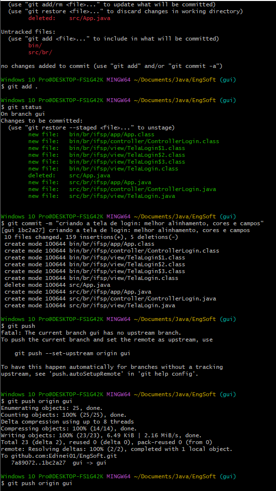

# Projeto: Janela de Login em Java Swing

Este projeto é uma atividade prática da disciplina **Engenharia de Software** sobre Gerenciamento de Configuração e Controle de Versão (GCCV), demonstrando o uso de Git para gerenciamento e controle de versão.

## Funcionalidades

Implementação de uma interface de login em Java, utilizando:
- **Java Swing** para a interface gráfica.
- **Classes de autenticação** para validar login e senha.

## Estrutura de Branches

1. **Main**: Branch principal do projeto.
2. **Design/GUI**: Para o desenvolvimento da interface gráfica.
3. **Classes**: Para a lógica de autenticação.

## Passo a Passo

### 1. Criação de Branches
- Foram criadas as branches `design/gui` e `classes` para desenvolvimento paralelo.
- Cada branch possui commits que documentam as alterações realizadas.

### 2. Desenvolvimento e Commits
- As modificações foram documentadas com mensagens de commit descritivas.
- Cada commit explica o que foi alterado e por que essa alteração é relevante para o projeto.

### 3. Merge e Resolução de Conflitos
- Um merge foi realizado entre as branches para integrar as funcionalidades.
- Qualquer conflito que surgiu foi resolvido e documentado.

### 4. Prints e Histórico de Commits
- Prints do uso do Git e o histórico de commits estão incluídos no repositório.

## Capturas de Tela do Git

### Git Log
Aqui está um exemplo do comando `git log`, mostrando o histórico de commits realizados no projeto:


### Commit: "atualização 1 da documentação"
Esta captura de tela mostra o commit com a mensagem `"atualização 1 da documentação"`:


### Criação e Verificação das Branches

Exemplo dos comandos usados para criar e alternar entre branches:


### Commit e Criação da Tela de Login
Aqui está o commit e as alterações realizadas para a criação da tela de login:


### Tela de Login em Execução
Aqui está a captura da tela de login funcionando no ambiente Java Swing:


### Nova Imagem Adicionada: img-6.png
Aqui está a nova captura de tela adicionada:


## Como Executar
Clone o repositório e compile o código com um ambiente Java:

1. Clone o repositório:
   ```bash
   git clone <url-do-repositório>
